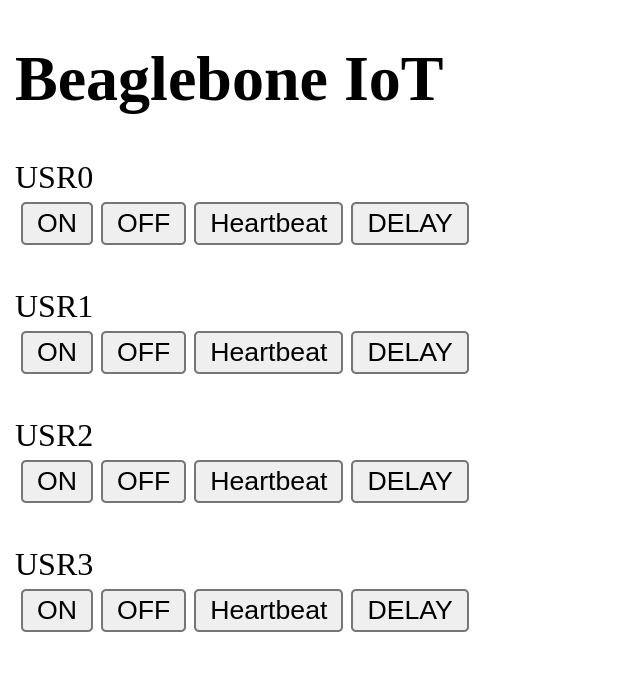

# Aplicação WEB utilizando a Beaglebone Black e seu sistema de arquivos

## Descrição

O objetivo dessa aplicação é piscar os 4 LEDs internos da beaglebone, através de uma interface WEB tanto pelo computador, quanto pelo celular. Para desenvolvimento, foi utilizado:

* Sistema de arquivo personalizado (criação via Buildroot)

* HTML, JavaScript, Node + Express

**OBS:** inicialmente implementado em Desktop e adaptado para a placa.

## Requisitos

* Node para processador ARM (instalar na beaglebone)

* Minicom, Cabo TTL, cabo de rede

---

## Registros do Funcionamento (Vídeo)

